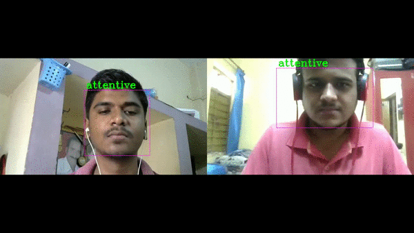
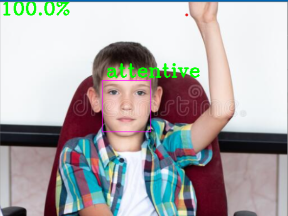
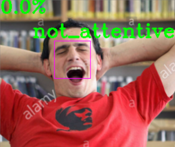

# Attentive Analysis
The project addresses the problem of attentiveness of a student during online lectures.
Hence the initial problem was to find whether student attending online lecture are attentive
or not.

## Screenshots

## Features
- To build an accurate model for implementation using inbuild algorithm.
- Add data of student into database, to know attentive index of that specific person during implementation.
- Implement model on the recorded videos and web cam input.

## Application
- Address student attentiveness.
- Proctoring for online exams.
- Attendance of students.
